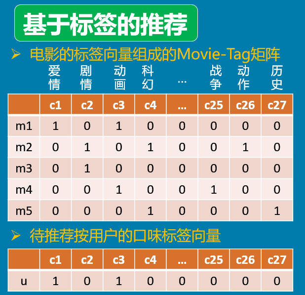
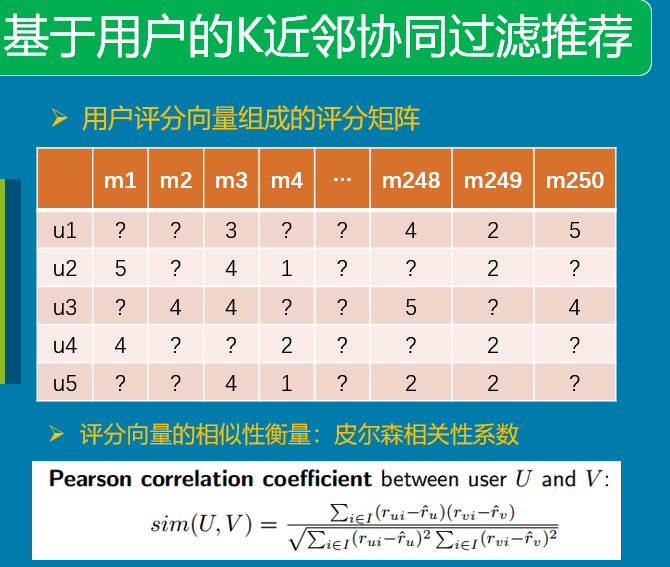

# Simple Recommder Algorithm

## 1.item-knn

基于标签的推荐算法。

推荐结果：找到和用户的喜好标签最匹配的 `K` 本图书。




### A.Api Requirement

```http
GET /users/{user_id}/recommender/item-knn?k_books={k_books}
```

请求参数
* 路径参数 (PathVariable) `user_id`
* 请求参数 (RequestParam) `k_books`: 返回的推荐图书数量

返回数据
* 推荐图书的 `id`

**[注]请求参数，返回数据均是JSON格式**

示例

**Request**

```http
GET /users/1/recommender/item-knn?k_books=5
```

**Response**

```javascript
{
    'rec_book_ids': [1, 3, 5, 7, 9]
}
```

### B.Steps:

1. 用 `pandas`库的 `DataFrame` 对象读数据库，生成 `user_tag_vector` 和所有图书的 `book_tag_vector`  
2. 调用 `sklean` 库的 knn 函数（余弦相似度？），返回相似度最高的 `K` 条记录

> 数据库中有很多标签，平均每本书有8个标签左右，所以标签转化为01向量会很稀疏，需要选用一个合适的计算01向量的相似度。

## 2. user-knn
基于用户协同过滤的推荐算法。每个用户都会有评分向量（评分取值为1-5）。

推荐结果：找到和该用户的评分习惯最相近的 `K` 个用户，从这 `K` 个用户评分过的电影中推荐。




### A.Api Requirement

```http
GET /users/{user_id}/recommender/user-knn?k_neighbors={k_neighbors}&k_books={k_books}
```

请求参数
* 路径参数 (PathVariable) `user_id`
* 请求参数 (RequestParam) `k_books`: 返回的推荐图书数量，默认为10
* 请求参数 `k_neighbors`：knn算法中的邻居数量，默认为5

返回数据
* 推荐图书的 `id`

**[注]请求参数，返回数据均是JSON格式**

示例

**Request**

```http
GET /users/1/recommender/category_based?k_neighbors=10&k_books=5
```

**Response**

```javascript
{
    'rec_book_ids': [1, 3, 5, 7, 9]
}
```

### B.Steps:

1. 用 `pandas`库的 `DataFrame` 对象读数据库，得到所有`user_rating_vector` 组成的评分矩阵。
2. 调用 `sklean` 库的 knn 函数（皮尔森相似度），返回相似度最高的 `K` 个用户评分向量
3. 利用上述的 `K` 个向量计算出用户喜欢的潜在图书

## 3.Code 

可借鉴代码：[简单电影推荐算法](<https://github.com/JuneScut/movieRecommandation/tree/master/recommender/knn>)

* API用 [flask](<http://flask.pocoo.org/docs/1.0/quickstart/#a-minimal-application>) 实现
* knn算法调用 [sklearn.neighbors.NearestNeighbors](<https://scikit-learn.org/stable/modules/neighbors.html>)

